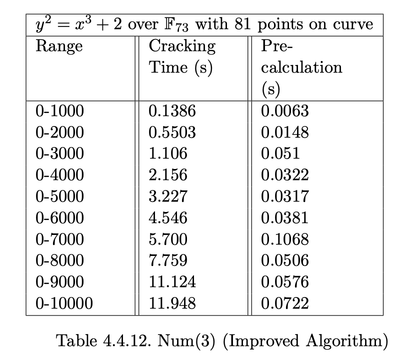

# Senior_Project_2020
This is my joint major Mathematical and Computer Science Senior Project in Bard College

# Abstract 
This thesis introduces the concept of Public-key cryptography, including RSA (Ron Rivest, Adi Shamir, Leonard Adleman) and ECC (Elliptic curve cryptography) system in the beginning chapters. Then, it uses two algorithms: Brute Force Algorithm for both RSA and ECC, and the Improved Algorithm only for ECC to mimic the cracking model for testing the security level in both systems. It designs experiments to run complexity analysis on RSA and ECC. Measuring the cracking time for private keys, this project compares the security level between the RSA cryptosystem and Elliptic curve cryptography.

Notably, this thesis concentrates on the elements that affect the security level of ECC. Early study in the field suggests that the size of the finite field and the scope of keys affect the security level of ECC. After collecting data that suggest the same result, this project focuses on the number of points on the corresponding elliptic curve, which proved to be another factor that affects the cracking time for private keys. This conclusion only applies to the improved algorithm, which is proven to be more effective than the brute force algorithm under various circumstances. Following the same trail of testing: the properties of the elliptic curve and cracking private keys through the improved algorithm, this thesis suggests that ECC should avoid elliptic curves with prime numbers of points over finite fields, due to our tests showing that they are less secure.
# Mark
This repo includes all testing code in this project. The major code is ecc_finite_fast.py which represents as the improved algorithm and ecc_finite_brute.py which representes the brutal force algorithm. 

# Conclusion
This thesis briefly introduces the Public-Key cryptography, including Elliptic Curve Cryptography and RSA cryptosystem through mathematical concepts. We implement the necessary procedures of the elliptic curve cryptography and the RSA, make programs to mimic their key generation processes, and use these programs to crack private keys in both systems. For elliptic curve cryptography, we also measure the cracking time to find out which element on an elliptic curve would affect the security level.

We firstly compare the cracking time for the private key between Elliptic curve cryptography and RSA cryptosystem. The conclusion was cohesive with previous research: Through Brute Force Algorithm, trying out every number for the private key within a broad range to find the right number, cracking a private key in ECC takes longer time than in RSA cryptosystem under the same key length. Meanwhile, it takes longer to crack a private key for both systems when we enlarge the key sizes. Furthermore, focusing on ECC only, the cracking time increases when we increase the size of p, which is the size of a finite field F p . In other words, larger finite fields can ensure higher security levels.

Secondly, we introduce the improved algorithm, another method for cracking the private key based on Schoof’s algorithm: Using concepts in group law to count the number of points on an elliptic curve over a finite field efficiently, we apply the order of a subgroup to cut down the cracking procedures. We make a comparison between this Improved Algorithm and Brute Force Algorithm. When the private key size increases, the Improved Algorithm takes much less time than the former method.

More essentially, we discover that the number of points on an elliptic curve also affects the cracking time for a private key. We see that the Improved Algorithm speeds up the cracking efficiency compared to Brute Force Algorithm, even when the size of a finite field increases. However, using Improved Algorithm forces us to pay attention to the property of the number of points on an Elliptic curve over the finite field. According to our tests, we found that the improved algorithm can only perform efficiently when the number of points on an elliptic curve is a large prime number, where this property of the curve does not impact the efficiency of brute force algorithm. This indicates that if curves have 2 k , or a composite number of points on the curve where k is a positive integer, using the improved algorithm to crack the private key becomes difficult. The reason might be related to the order of a subgroup and components of a composite number but I have not carried out the related research. This thesis strengthens my interest in cryptography and I will proceed to improve this research in the future, figuring out what makes an elliptic curve more suitable for cryptography facing various cracking methods.
